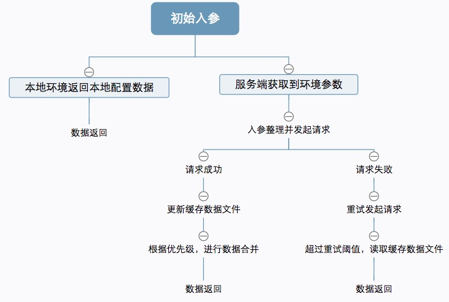

### 基本需求

轮询请求接口返回的数据，并进行相同字段的合并。

### 功能点

* 要支持同时多个接口的轮询，因为可能区分公共数据接口和项目私有的数据接口。
* 相同字段的合并要遵循一定优先级，同项目的服务端数据自然优先于本地配置数据。
* 合并过程中要保持引用传递，实现调用方的数据实时更新。

### 流程图



### 回顾

只是整理总结了下当时需要的功能实现，并没有提供一个可以直接使用的模块。在整理的过程中，也发现了之前的问题：

模块是采用的构造函数加原型的模式进行实现的，在扩展方法时，直接是替换掉了整个原型对象

```
function Config () {
 .....
 .....
}

Config.prototype = {
 ......
 ......
}

```
这样其中的constructor属性也被修改成了Object的构造函数，虽然不会导致功能上的问题，但还是可以尝试进行恢复：

```
Config.protoype = {
 constructor: Config,
 ......
 .....
}
```
此时的constructor是可枚举的，要完全恢复成不可枚举的属性可以（ECMAScript5）：

```
Config.prototype = {
 ......
 ......
}

Object.defineProperty(Config.prototype, "constructor", {
    enumerable: false,
    value: Config
});
```